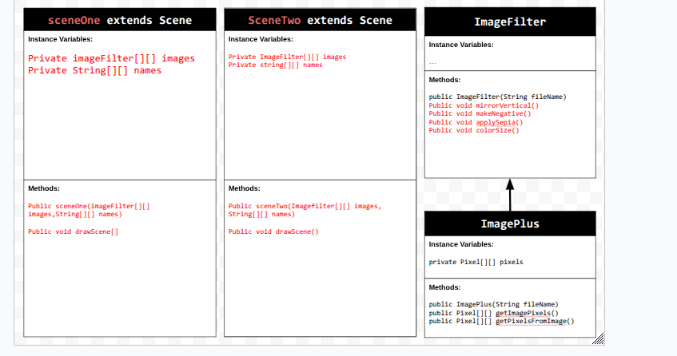

# Unit 5 - Personal Narrative / Interest Animation

## Introduction

Images are often used to portray our personal experiences and interests. We also use image filters and effects to change or enhance the mood of an image. When combined into collages and presentations, these images tell a story about who we are and what is important to us. Your goal is to create an animation using The Theater and Scene API that consists of images of your personal experiences and/or interests. In this animation, you will incorporate data related to these experiences and/or interests that can be organized in a 2D array, and use image filters and effects to change or enhance the mood of your images.
## Requirements

Use your knowledge of object-oriented programming, two-dimensional (2D) arrays, and algorithms to create your personal narrative collage or animation:
- **Write Scene subclasses** – Create two Scene subclasses: either two core parts of your personal life, or two components of a personal interest. Each class must contain a constructor and private instance variable with data related to the scene
- **Create at least two 2D arrays** – Create at least two 2D arrays to store the data that will make up your visualization.
Implement algorithms – Implement one or more algorithms that use loops and logic that operate on the data in your 2D arrays.
- **Create a visualization** – Create an animation that conveys the story of the data by illustrating the patterns or relationships in the data.
- **Image Filters** – Utilize the image filters created in this unit (and possible new filters) that show a personal flare to the images used in your animation.
- **Document your code** – Use comments to explain the purpose of the methods and code segments and note any preconditions and postconditions.

## UML Diagram

## Video

Record a short video of your story to display here on your README. You can do this by:

- Screen record your project running on Code.org.
- Upload that recording to YouTube.
- Take a thumbnail for your image.
- Upload the thumbnail image to your repo.
- Use the following markdown

## Story Description

My animation shows many pictures of minions and thier names and alters how the images look by using filters such as flip  vertical. The 2D arrays I used for this project are one for all the images and one for the minions names.

## Image Filter Analysis

2 of the four filters that I used and want to explain are the flip vertical filter and the colorize.The flip vertical flips the image in half by mirroring it and the colorize filter changes the colors used in the iage by changing the numbers used in it.
